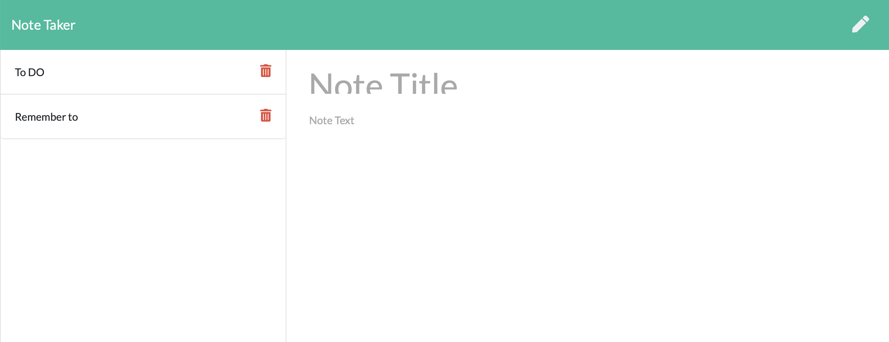
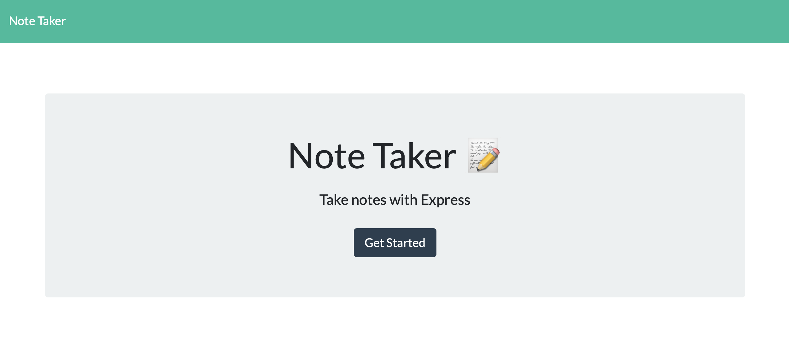

# Note Taker App

https://migs-notetaking.herokuapp.com  
https://github.com/MigsGithub/NoteTaker_APP_HW11

## Description

An application that can be used to write, save, and delete notes. This application will use an express backend and save and retrieve note data from a JSON file.

AS A user, if want to be able to write and save notes, this is the App

Application  allow users to create and save notes.

Application  allow users to view previously saved notes.

Application  allow users to delete previously saved notes.

## Images

